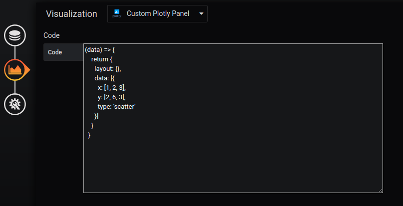

# Usage
1. clone the repository to the plugin directory (e.g. `/var/lib/grafana/plugin/`)
2. `yarn install`  or `npm install`
3. `yarn build`
4. restart grafana server

# Configuration
You can customize the plot and layout data in the `code` section. The `data` argument is of type `PanelData`. 
The returned object has `layout` and `data` fields. 
The `layout` override the default layout settings ([doc](https://plot.ly/javascript/reference/#layout)).
The `data` is in the `PlotData` format. Some code snippets are available in `sample_codes` directory.

